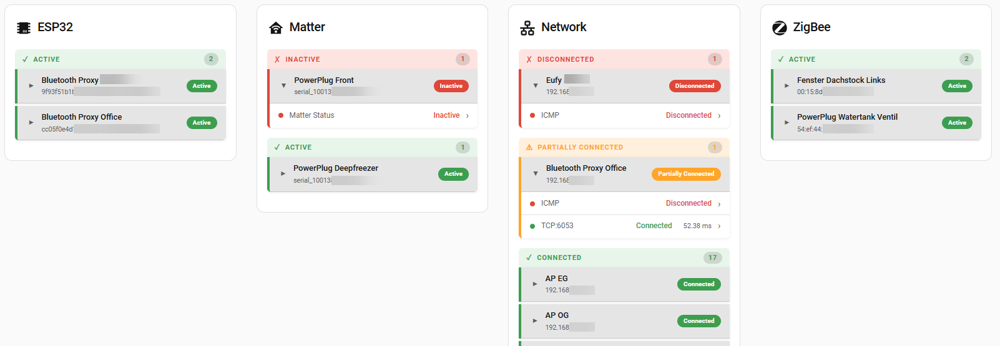
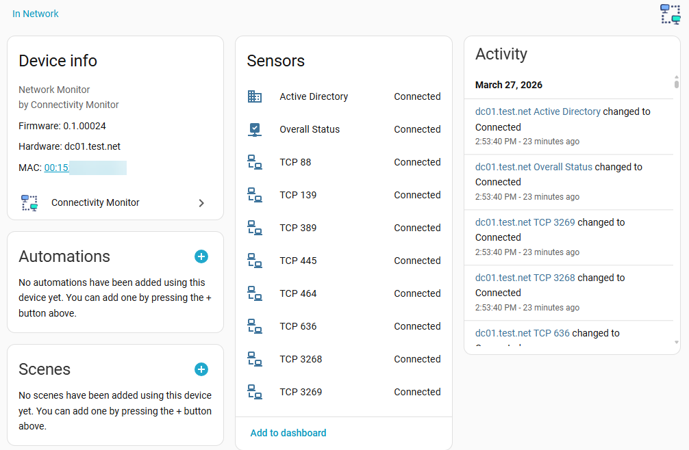

# Connectivity Monitor

Adds a Connectivity Monitor to Home assistant. This integration requires [HACS](https://hacs.xyz).

## Features

This integration allows to monitor devices and create Alarams and Alert Actions.

- Device Types:
  - Network Devices:
    - TCP
    - UDP
    - ICMP
    - Active Directory Domain Controller
    - supports targets with IP-Address or FQDN
  - ZigBee (ZHA)
- allows to add later more targets or remove them again
- allows to use a custom DNS server to resolve FQDN

## Example

### Overview Panel

### Device View

## Setup

Recommended to be installed via [HACS](https://github.com/hacs/integration)

1. Go to HACS -> Integrations
2. Add this repo to your HACS custom repositories:
    - [https://github.com/joshburkard/ConnectivityMonitor](https://github.com/joshburkard/ConnectivityMonitor)
3. Search for "Connectivity Monitor" and install.
4. Restart Home Assistant
5. Open Home Assistant Settings -> Devices & Serivces
6. Shift+reload your browser to clear config flow caches.
7. Click ADD INTEGRATION
8. Search for "Connectivity Monitor"
9. Define the DNS Server to use
10. Define the Target Host to monitor, the needed protocol and port and click on `Submit`
11. if you want to monitor additional targets check the checkbox `another` and click on `Submit`
12. configure the interval and click on `Submit`
13. done, if you want to edit your settings, you can click on your integration on on `CONFIGURE`

## Change Log

here you will find the [Change Log](changelog.md)

## Notes

This custom component was created without any knowledge of Python but with use of Claude AI

## Tasks

this changes are planned:

- [x] create an Overall sensor per device
- [ ] add Device information:
  - [ ] IP-Address
  - [ ] MAC Address
- [x] let use of `Add Device`
- [x] change default interval to 300 seconds

## Icon

the icon and logo is made by [Freepik - Flaticon](https://www.flaticon.com/free-icons/electronics)